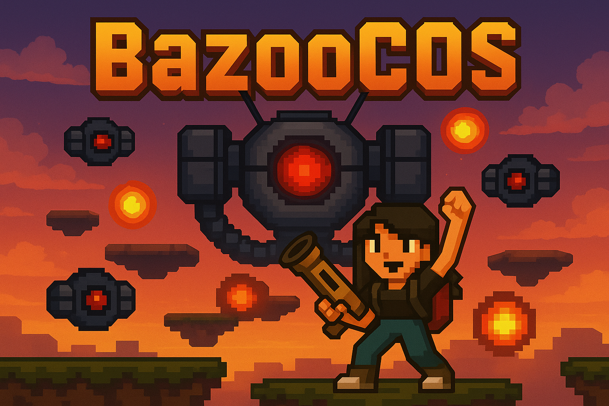

🎮 ¿De qué va Bazoocos?

En Bazoocos controlarás a la ingenieria en telecomunicaciones armada con un lanzacohetes Hispano, María del Cos,  mientras esquivas drones enemigos, disparas en todas direcciones y recoges mejoras. Cada cierto tiempo, un Boss Dron gigante aparece en pantalla para desafiar tu habilidad.

Tu objetivo: aguantar todo lo posible, destruir todo lo que se mueva, y sobrevivir.

📜 Reglas del Juego

👤 Jugador
	•	Movimiento horizontal con A/D o ← →.
	•	El jugador salta solo al tocar plataformas.
	•	Apunta con el ratón y dispara con Click izquierdo.
	•	Click derecho activa el escudo, que bloquea un proyectil.
	•	Si caes por debajo de la pantalla o pierdes toda la vida → GAME OVER.

🛰️ Enemigos
	•	Drones enemigos vuelan de lado a lado y disparan bombas.
	•	La dificultad escala: más drones aparecen conforme subes de puntuación.
	•	Cada 200 puntos aparece un Boss.

👾 Boss Dron
	•	Se desplaza lateralmente de forma constante.
	•	Cada 10 segundos lanza un ataque circular con 20 láseres radiales.
	•	Tiene 5 corazones (50 HP).
	•	No puede ser hackeado.
	•	Eliminarlo te da +10 puntos y una pausa temporal de drones.

💎 Power-ups

Cada vez que destruyes un dron, puede aparecer un drop aleatorio:

Ítem	Efecto
🧠 Hackeo	Drones se congelan durante unos segundos
⚡ Velocidad	Aumenta temporalmente tu velocidad de salto
🔁 Multiproyectil	Disparas múltiples proyectiles a la vez
🧲 Magnetismo	Atrae todos los drops cercanos
🛡️ Escudo extra	Añade una carga al escudo
🪙 Microchip	+1 punto de puntuación extra
Por cada microchip aumenta tu velocidad y cadencia de disparo

⸻

🎮 Controles

▶  Movimiento:         A / D  o  Flechas Izquierda / Derecha
▶  Apuntar:            Ratón (360º)
▶  Disparar:           Click izquierdo
▶  Escudo:             Click derecho
▶  Pausa / Reset:      Escape (WIP)

⸻

🛠️ Instalación
	1.	Clona este repositorio:

git clone https://github.com/rubenvmu/bazoocos.git
cd bazoocos

	2.	Crea entorno virtual (opcional pero recomendado):

python3 -m venv venv
source venv/bin/activate  # o .\venv\Scripts\activate en Windows

	3.	Instala dependencias:

pip install -r requirements.txt

	4.	Ejecuta el juego:

python main.py

⸻

🧠 Créditos y Licencia

Este juego fue creado con ❤️ por [Ruben] para María del Cos por su 22 cumpleaños.
Licencia MIT — puedes modificarlo, compartirlo o hackearlo a tu gusto.
